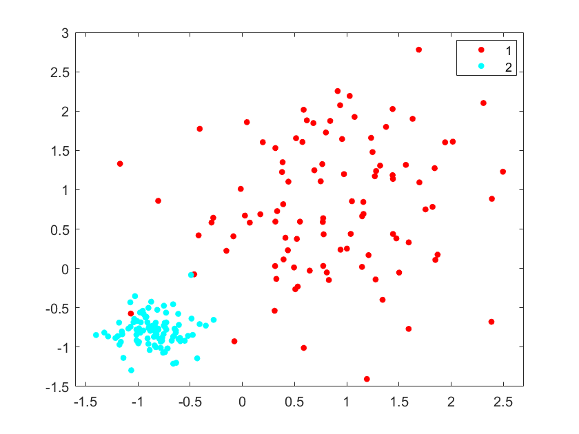
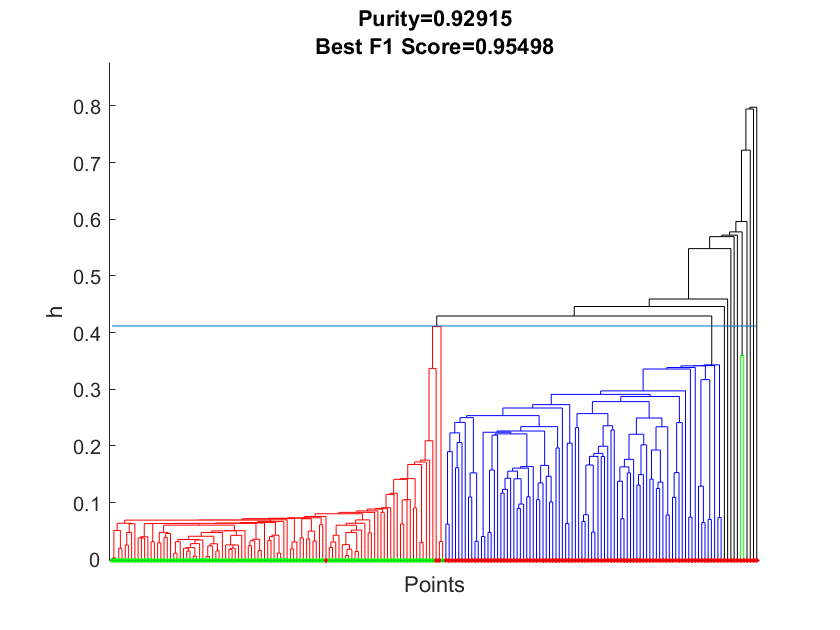
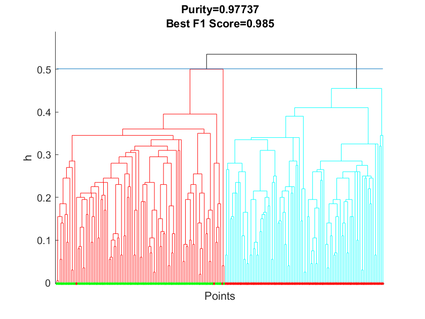

# IK-AHC

This repository is used for demonstration of using Isolation Kernel to improve agglomerative hierarchical clustering algorithms. It contains the implementation of IK_AHC using MATLAB and Python.

Written by Ye Zhu@Deakin University and Xin Han@University of Macau, Mar 2023, version 1.0.

## Demo
A comparison of AHC and IK-AHC on a two dimensional dataset is shown below with the Matlab code [(demo.m)](https://github.com/zhuye88/IK-AHC/tree/main/Matlab/demo/demo.m).

<em>Scatter plot of the data:<em>




<em>AHC with single linkage based on Euclidean distance:<em>




<em>AHC with single linkage based on Isolation Kernel:<em>



---
## Citation
---
If you use it for a scientific publication, please include a reference to this paper.

* Xin Han, Ye Zhu, Kai Ming Ting, and Gang Li, [The Impact of Isolation Kernel on Agglomerative Hierarchical Clustering Algorithms](https://doi.org/10.1016/j.patcog.2023.109517), <i>Pattern Recognition</i>, Vol 139, July 2023, 109517.

`BibTex` information:

```bibtex
@article{HZTLThe2023,
  author = {Han, Xin and Zhu, Ye and Ting, Kai Ming and Li, Gang},
  title = {The Impact of Isolation Kernel on Agglomerative Hierarchical Clustering Algorithms},
  journal = {Pattern Recognition},
  volume = {139},
  year = {2023},
  url = {https://doi.org/10.1016/j.patcog.2023.109517},
}
```


---
### License
---

BSD license
